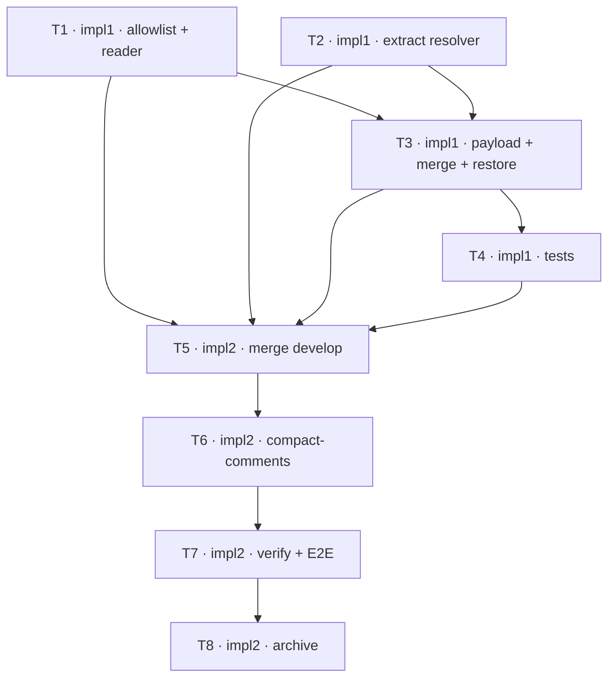

## TODOs: Capture Claude Launch Environment

Status legend: `[ ]` pending · `[x]` done. Each row flips inside its own commit — by the row's owner
where its role is ungated, by that owner's critic on APPROVE where the `Critics:` line arms it.
Critics: plan=1 impl=1

### Capture
| ID | Agent | Task | Depends on | Status |
|----|-------|------|------------|--------|
| T1 | impl1 | Add the two-tier allowlist (`LAUNCH_ENV_CONFIG_NAMES`, `LAUNCH_ENV_SECRET_NAMES`, `LAUNCH_ENV_SAFE_SECRET_VALUE`, `LAUNCH_ENV_REDACTED_MARKER`), the `PROC_ROOT` seam, and `read_launch_env` to `scripts/zellaude-hook.sh`, near `find_agent_pid`. NUL-safe environ read; emits nothing when the environ cannot be read. No payload wiring yet. | — | [x] |
| T2 | impl1 | Extract `resolve_effort_level` from `detect_claude_rainbow` (`:687-688`) and call it from there, preserving the existing precedence and every current rainbow outcome. Pure refactor — no behavior change, no payload wiring. Success criterion for this row: `tests/hook_mode_detection.sh` stays green, which is what proves the claim; it covers the rainbow and ultracode outcomes this function decides. | — | [x] |
| T3 | impl1 | Wire `launch_env` and `current_effort_level` into `PAYLOAD`; add the null-keeps-`$previous` guard for both to the `persist_root_state` merge; `del(.launch_env)` in `restore_cached_states`; emit `launch_env: null` under `--inspect`. Four distinct properties in one chunk — its review should check each, not just the payload wiring. | T1, T2 | [ ] |
| T4 | impl1 | Tests beside `tests/hook_mode_detection.sh`: both capture paths via a `ZELLAUDE_PROC_ROOT` fixture (reuse the `write_environ` idiom from `tests/attach_detection.sh:21-27`), the secret tiers incl. the `local` escape and the `<set>` marker, `null` vs `{}`, the merge null-guard, the `--restore` strip, and `--inspect` emitting `launch_env: null`. | T3 | [ ] |

### Finalize
| ID | Agent | Task | Depends on | Status |
|----|-------|------|------------|--------|
| T5 | impl2 | Merge from the integration branch: the moment deps clear — no gate — merge `develop` into the feature branch, resolving conflicts with best judgment. An extra merge loop appends fresh rows; this one never re-runs. Protocol: `madev-impl` Finalization. | T1, T2, T3, T4 | [ ] |
| T6 | impl2 | Compact-comments pass over the touched files per the session's coding standards: default none, terse WHY only; light touch-ups, no behavior change; remove resolved CLAUDE notes; commit. | T5 | [ ] |
| T7 | impl2 | Run the PLAN's Verification on the merged + tidied state, E2E included — preflight first, then run it unattended when it fits; artifacts to `/tmp/capture-claude-launch-env`. A `.current_effort_level` mismatch is a finding about `CLAUDE_EFFORT`, reported, never patched around. On failure or preflight no-go, report to the planner and wait for the routed fix — never self-fix; loop until clean. | T6 | [ ] |
| T8 | impl2 | Archive on the planner's explicit go: clear leftover feature CLAUDE notes, append the History entry, delete/prune this feature's in-flight seed, `git rm` the PLAN+TODO pair (`[archive]`), `macoord cleanup`. Protocol: `madev-impl` Finalization. | T7 | (Not possible to mark after deletion) |

**Dependency graph**

**Launch order** — open every session at once; blocked ones idle on `wait-for`.
- `impl1` — entry T1 (—) · `impl1-crit`
- `impl2` — entry T5 (waits on T1–T4) · `impl2-crit`

T1–T4 are one implementer because they share continuous context: a single script, a single feature, and
the tests for it. T1 and T2 are independent of each other but edit the same file, so they are sequential
within the agent rather than parallel across agents — the disjoint-file rule, not a preference.
