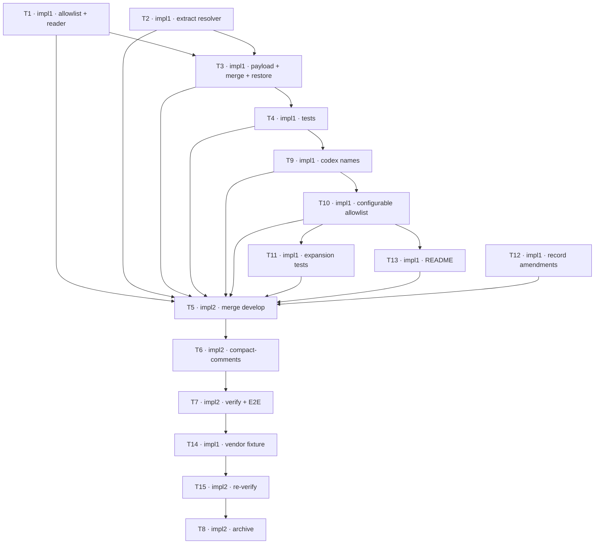

## TODOs: Capture Claude Launch Environment

Status legend: `[ ]` pending · `[x]` done. Each row flips inside its own commit — by the row's owner
where its role is ungated, by that owner's critic on APPROVE where the `Critics:` line arms it.
Critics: plan=1 impl=1

### Capture
| ID | Agent | Task | Depends on | Status |
|----|-------|------|------------|--------|
| T1 | impl1 | Add the two-tier allowlist (`LAUNCH_ENV_CONFIG_NAMES`, `LAUNCH_ENV_SECRET_NAMES`, `LAUNCH_ENV_SAFE_SECRET_VALUE`, `LAUNCH_ENV_REDACTED_MARKER`), the `PROC_ROOT` seam, and `read_launch_env` to `scripts/zellaude-hook.sh`, near `find_agent_pid`. NUL-safe environ read; emits nothing when the environ cannot be read. No payload wiring yet. | — | [x] |
| T2 | impl1 | Extract `resolve_effort_level` from `detect_claude_rainbow` and call it from there, preserving the existing precedence and every current rainbow outcome. Precedence unchanged. NOTE (revision): the resolver also downcases the env fallback — a deliberate behavior change ruled by the planner, superseding this row's original 'no behavior change' contract; see the PLAN's normalization bullet. Success criterion for this row: `tests/hook_mode_detection.sh` stays green, which is what proves the claim; it covers the rainbow and ultracode outcomes this function decides. | — | [x] |
| T3 | impl1 | Wire `launch_env` and `current_effort_level` into `PAYLOAD`; add the null-keeps-`$previous` guard for both to the `persist_root_state` merge; `del(.launch_env)` in `restore_cached_states`; emit `launch_env: null` under `--inspect`. Four distinct properties in one chunk — its review should check each, not just the payload wiring. | T1, T2 | [x] |
| T4 | impl1 | Tests beside `tests/hook_mode_detection.sh`: both capture paths via a `ZELLAUDE_PROC_ROOT` fixture (reuse the `write_environ` idiom from `tests/attach_detection.sh:21-27`), the secret tiers incl. the `local` escape and the `<set>` marker, `null` vs `{}`, the merge null-guard, the `--restore` strip, and `--inspect` emitting `launch_env: null`. | T3 | [x] |

### Expansion (added by revision — user ordered both deferred seeds built here)
| ID | Agent | Task | Depends on | Status |
|----|-------|------|------------|--------|
| T12 | impl1 | Record the two planner-ordered amendments already committed as `7db9fc6` (merge guard keeps `$previous` on any event, `SessionStart` included) and `79da350` (`current_effort_level` null for `CLIENT=codex`). No new code — this row exists so work done under a chat order is visible on the board and reviewable. `impl1-crit` reviews both commits and flips it. | — | [x] |
| T9 | impl1 | Add `CODEX_SQLITE_HOME` and `OPENAI_BASE_URL` to the config tier. `OPENAI_BASE_URL` is annotated in-code as vendor-buggy (codex currently ignores it, openai/codex#16719) and captured anyway: replay fidelity is *sameness*, not effectiveness — the relaunched session must ignore it too. `CODEX_SQLITE_HOME` is single-source and unconfirmed; annotate it as such. Both names must also join the E2E's `env -u` list per the PLAN's ambient-name rule. | T4 | [x] |
| T10 | impl1 | Merge a user allowlist from `zellaude.json` into the built-in lists per the PLAN: extension only, predefined tiers frozen, escape set untouchable, bad file ignored. Note this moves the settings read out of the `PermissionRequest` branch onto every payload-building event. | T9 | [x] |
| T13 | impl1 | Document the launch-env allowlist key in `README.md` as its own subsection beside **Custom states** and **Session templates** — it is a hand-edited `zellaude.json` key, not a bar-menu toggle, so it does not belong in the Settings table. Cover the two lists, that predefined tiers and the escape set are frozen, that secrets record `<set>`, and that a bad file falls back to the built-ins. | T10 | [x] |
| T11 | impl1 | Tests for T9 and T10: the added names; extension of each tier; a config attempting to re-tier a predefined secret name (must stay `<set>`); a config attempting to extend the escape set (must not); malformed, unreadable and absent settings files (all yield the built-ins); and a narrowed allowlist producing a smaller object. | T10 | [x] |

### Vendor-shape coverage (added by revision 2)
| ID | Agent | Task | Depends on | Status |
|----|-------|------|------------|--------|
| T14 | impl1 | Preserve the real vendor `PreToolUse` payload impl2 captured (`/tmp/capture-claude-launch-env/probe2/stdin-638096-PreToolUse.json`, claude 2.1.252) as a test fixture, eliding `session_id`, `transcript_path`, `cwd`, `prompt_id`, `tool_input`, `tool_use_id` **and `permission_mode`** but keeping `effort: {level: "high"}`, `hook_event_name` and `tool_name` verbatim — three kept, seven elided, which partitions the payload's ten keys exactly. `permission_mode` is elided rather than kept because its captured value is `bypassPermissions`, an artifact of the `--dangerously-skip-permissions` the diagnostic needed to run unattended; nothing in the hook reads it, so keeping it would freeze a flag no ordinary user runs into a file readers take as a typical payload. The fixture's whole value is that every field in it is unmodified vendor output — eliding preserves that, editing the value to `default` would destroy it. Add a case feeding it to the hook and asserting `current_effort_level == "high"`. **Copy the file out of `/tmp` first — it is the only surviving evidence and nothing protects it from cleanup.** Purpose: the one-off diagnostic proved a real claude populates `.effort`; a fixture makes that reproducible instead of a claim in prose. The fixture MUST carry its provenance in the test file itself — one line, e.g. "a redacted subset of a real claude 2.1.252 PreToolUse payload: fields removed, none altered". Every other record of that provenance dies with this run (this row is `git rm`'d at T8, the chat goes with the session), leaving a three-field JSON that reads as a hand-written stub — and the natural way to improve a stub is to add plausible fields, which is the exact fabrication this spec exists to prevent. | T7 | [ ] |
| T15 | impl2 | Re-run the PLAN's Verification on the tree including T14 — suites, `bash -n`, `cargo build`, and `cargo test --target x86_64-unknown-linux-gnu --features zellij-utils/vendored_curl`. The E2E does NOT need re-running: T14 adds a fixture-driven test, touches no hook code, and the E2E's six pass conditions already hold on this tree. Say so explicitly in the report rather than silently skipping it. | T14 | [ ] |

### Finalize
| ID | Agent | Task | Depends on | Status |
|----|-------|------|------------|--------|
| T5 | impl2 | Merge from the integration branch: the moment deps clear — no gate — merge `develop` into the feature branch, resolving conflicts with best judgment. An extra merge loop appends fresh rows; this one never re-runs. Protocol: `madev-impl` Finalization. | T1, T2, T3, T4, T9, T10, T11, T12, T13 | [x] |
| T6 | impl2 | Compact-comments pass over the touched files per the session's coding standards: default none, terse WHY only; light touch-ups, no behavior change; remove resolved CLAUDE notes; commit. | T5 | [x] |
| T7 | impl2 | Run the PLAN's Verification on the merged + tidied state, E2E included — preflight first, then run it unattended when it fits; artifacts to `/tmp/capture-claude-launch-env`. A `.current_effort_level` mismatch is a finding about `CLAUDE_EFFORT`, reported, never patched around. On failure or preflight no-go, report to the planner and wait for the routed fix — never self-fix; loop until clean. | T6 | [x] |
| T8 | impl2 | Archive on the planner's explicit go: clear leftover feature CLAUDE notes, append the History entry (if it names the client version it is **2.1.252** — verified against the captured session's transcript and `claude --version`, not reproduced from an earlier draft that said 2.1.251), delete/prune this feature's in-flight seed, `git rm` the PLAN+TODO pair (`[archive]`), `macoord cleanup`. Protocol: `madev-impl` Finalization. | T15 | (Not possible to mark after deletion) |

**Dependency graph**

**Launch order** — open every session at once; blocked ones idle on `wait-for`.
- `impl1` — entry T1 (—) · `impl1-crit`
- `impl2` — entry T5 (waits on T1–T4, T9–T13) · `impl2-crit`

Revision note: T9–T11 are appended rather than folded into T1 because T1 was already committed and
reviewed when the expansion arrived; editing a flipped row would hide the change from its own review.
T12 likewise records work ordered by chat while impl1 was mid-run, so the board shows it rather than
leaving it invisible to the board and the stall detector.

T1–T4 are one implementer because they share continuous context: a single script, a single feature, and
the tests for it. T1 and T2 are independent of each other but edit the same file, so they are sequential
within the agent rather than parallel across agents — the disjoint-file rule, not a preference.
