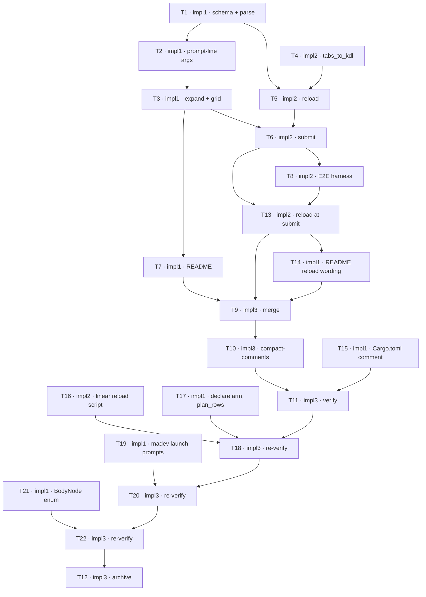

## TODOs: Layout Generator

Status legend: `[ ]` pending · `[x]` done. Each row flips inside its own commit — by the row's owner where its role is ungated, by that owner's critic on APPROVE where the `Critics:` line arms it.
Critics: plan=1 impl=1

### Phase 1 — Generator module
| ID | Agent | Task | Depends on | Status |
|----|-------|------|------------|--------|
| T1 | impl1 | Add `kdl = "4.7"` to `Cargo.toml` and commit the resulting `Cargo.lock` change with it (the version is already pinned there, but the root entry's dependency list gains `kdl`; both files are T1's). Create `src/layout_generators.rs` with the constants, `GeneratorFile`, `CustomStateSources`, `FloorOverrides`, `PaneFloors::resolve`, `parse_floor_overrides`, `TabGeometry`, `SourceTab`, `LayoutGenerator`, and `parse_generator_files`: parse the declaration nodes (`command`, `arg`, `flag`, `min_pane_*`) and the body (`tab`/`pane`/`each`, `if`/`unless`, `for`/`in` with the range grammar) into a validated tree; unknown node/property/variable, duplicate variable, structural misuse, and a duplicate `command` across files refuse with the file basename. Create `tests/layout_generators.rs` on the `#[path]` pattern with the parse-error and floors-chain cases. Note: that harness also `#[path]`-includes `src/custom_layouts.rs`, which impl2 edits in parallel (T4); a compile failure inside that file mid-edit is impl2's transient state, not a T1 bug — retry, never touch the file. | — | [x] |
| T2 | impl1 | Prompt-line argument parsing in `layout_generators.rs`: whitespace tokens, command lookup, positionals in order among flags in any order, `value` / `optional-value` / presence flags, defaults, and the refusals (unknown flag, missing or non-integer value, leftover token). Tests for every case. | T1 | [x] |
| T3 | impl1 | Expansion and layout in `layout_generators.rs`: bind `{tab}` and the parsed variables; evaluate `each` ranges with checked arithmetic, `if`/`unless`, nested order (i-major); substitute `{name}` (integers raw; `{tab}` raw in names, single-quoted in commands); default tab names `<source>-<ordinal>`; validate resolved names in the generator's voice; `plan_rows` under the floors with the `does not fit` refusal; `invoke` emits one `CustomLayout` (`CommandGrid::Rows`) per tab. Tests: ranges, conditions, substitution and quoting (`it's`, `x'; id; '`), default and templated names, the `plan_rows` table, the madev file's three invocations, KDL round-trip geometry. | T2 | [x] |

### Phase 2 — Multi-tab emission
| ID | Agent | Task | Depends on | Status |
|----|-------|------|------------|--------|
| T4 | impl2 | `src/custom_layouts.rs`: `tabs_to_kdl` (one `tab name=<id>` per entry, `focus=true` on the first only), `CustomLayout::to_kdl` delegating through `slice::from_ref`, `TabChrome::bar_rows`, and the `Prompt.pending_submit` field initialised in `Prompt::new`. `tests/custom_layouts.rs`: two-tab round-trip with `parsed.tabs.len() == 2` and one focused tab, one-tab output byte-identical to before, `bar_rows` with and without the plugin's own bar. | — | [x] |

### Phase 3 — Reload and submit
| ID | Agent | Task | Depends on | Status |
|----|-------|------|------------|--------|
| T5 | impl2 | `src/main.rs` + `src/state.rs`: `mod layout_generators`; the new `State` fields; `RELOAD_CUSTOM_STATES_SCRIPT` (sh + jq envelope, `LC_ALL=C` order, `*.kdl` only, missing `zellaude.json` → `{}`); `reload_custom_states` issued from `start_custom_layout_prompt`; the `reload_custom_states` result arm feeding `apply_custom_state_sources` (custom_states with plugin-block precedence, floor overrides, generators, both error slots, empty-input hint refresh, `pending_submit` resolution); a non-zero exit clears the in-flight flag and reports; `open_custom_layout` defers while a reload is in flight. Inline tests run the script through real `sh` against a temp `HOME`. | T1, T4 | [x] |
| T6 | impl2 | Submit path in `src/main.rs`: find the source tab by position (`manifest.panes.iter()`), `prompt_source_tab` from `TabInfo.name` and `display_area_*` minus `bar_rows`, `resolve_custom_state` (exact id first, then `layout_generators::invoke`), emission through `tabs_to_kdl`, every error to `prompt.error` with the file prefix. | T3, T5 | [x] |

### Phase 4 — Docs and E2E harness
| ID | Agent | Task | Depends on | Status |
|----|-------|------|------------|--------|
| T7 | impl1 | `README.md`: Features bullet; "Custom states" — hot reload replaces "Reload the plugin", the floors replace the Zellij-fit sentence; new "Generators" subsection documenting the PLAN's vocabulary verbatim (directory, `command`/`arg`/`flag`, `tab`/`pane`/`each`, `if`/`unless`, ranges, `{tab}` and default names, the floors chain with the `zellaude.json` keys, refusals) with the madev file as the example. | T3 | [x] |
| T8 | impl2 | E2E harness under `/tmp/layout-generator/e2e/`: staged `HOME`, `e2e.kdl`, `grid.kdl` and `hot.kdl`, the permissions pre-grant, the python pty driver with per-case refocus, `run.sh` implementing the PLAN's three cases, preflight and cleanup; exit 0 only when every assertion holds. Run it once to prove it executes. Never staged, never in the repo. | T6 | [x] |
| T13 | impl2 | Reload at submit in `src/main.rs`: `open_custom_layout` only records `pending_submit` and issues `reload_custom_states` (the open-time reload stays for the hint); the result arm's `resolve_pending_submit` calls the new non-deferring `launch_custom_state` (geometry, resolve, emit, launch; never reloads; no other caller), so the cycle is one deep and Enter resolves against the files as of that moment; inline test: a refusal, then a corrected document, then the same input resolves on the next Enter without cancelling. Add E2E case 4 to the harness (`hot.kdl` gains `min_pane_height 40` so `hot 3` refuses with `does not fit`; remove the line, `Enter` again with no other key → a new tab id named `e2e-hot` with exactly three panes, asserted by tab id) and run it green. | T6, T8 | [x] |
| T14 | impl1 | `README.md` only: the two sentences that say files are re-read each time the prompt opens (the Custom states paragraph at `:79` and the Generators intro) become: "Zellaude re-reads this file, and every generator file, when the prompt opens and again on every Enter, so an edit applies to the next submit without reloading the plugin or restarting the session. A refusal leaves the prompt open with what you typed, so you can fix the file it names and press Enter again." and "Files are re-read when the prompt opens and again on Enter, so a new generator works without restarting anything, and an edit lands on the very next submit." | T13 | [x] |
| T15 | impl1 | `Cargo.toml` only: replace the `kdl` line's comment ("Already compiled in through zellij-utils, which does not re-export it.") with "In the dependency tree via zellij-utils, which neither re-exports it nor links it — first real use costs ~153 KiB of wasm." (rev 11 retracted the premise the old comment states). | — | [x] |
| T16 | impl2 | `src/main.rs`: rewrite `RELOAD_CUSTOM_STATES_SCRIPT` so nothing large goes through argv: `zellaude.json` read with `--rawfile` (a missing file selects `--arg settings '{}'` in the shell), one `{path, content}` object per generator file emitted into a pipe (`--rawfile content`, path in argv is fine), the stream wrapped once with `jq -s`; inline test: a 200 KiB generator file AND a 200 KiB `zellaude.json` round-trip intact (a single argv string fails at 128 KiB, measured E2BIG at 200,000 bytes; the repo's own save test already writes ~150 KB). `src/custom_layouts.rs`: one comment line on `to_kdl` saying why both `#[cfg(test)]` and `#[allow(dead_code)]` are needed (the `src/main.rs --test` build calls nothing). | — | [x] |
| T17 | impl1 | `src/layout_generators.rs`: name the `min_pane_height` arm in `Declarations::declare` instead of `_` (a sixth declaration node must fail to compile, not fall through); drop the unreachable `.max(1)` in `plan_rows` (`PANE_FRAME_COLUMNS` makes the sum ≥ 2). | — | [x] |
| T18 | impl3 | Re-run the PLAN's Verification on the fixed tree (suite, wasm build, E2E), same protocol and artifacts as T11; report failures to the planner and wait. | T11, T16, T17 | [x] |
| T19 | impl1 | From the user's CLAUDE note at `README.md:119`: the madev example's pane commands become the real launches — `claude -n impl{i} '/madev-impl impl{i}'` and `claude -n impl{i}-crit{k} '/madev-impl-crit impl{i}-crit{k}'` (single quotes; no KDL escapes) — in `README.md`, in the T3 fixture and its expected expansions in `tests/layout_generators.rs`, matching the PLAN's vocabulary block byte for byte; remove the note. | — | [x] |
| T20 | impl3 | Re-run the PLAN's Verification on the tree after T19 (suite, wasm build, E2E), same protocol and artifacts as T18; report failures and wait. | T18, T19 | [x] |
| T21 | impl1 | `src/layout_generators.rs` only: a `BodyNode` enum with `from_node_name`; `parse_tab_nodes` and `parse_pane_nodes` match on it exhaustively (no `_` arms); the `BODY_NODES` string array retired. No behaviour change: every refusal message identical, existing tests unchanged. | — | [x] |
| T22 | impl3 | Re-run the PLAN's Verification on the tree after T21 (suite, wasm build, E2E), same protocol and artifacts as T20. The wasm figure will exceed the pinned 1,932,476 B by the `BodyNode` enum's cost, as T17's enum cost 88 B: report the measured figure with the enum named as the cause, for the planner to re-pin — that overage is expected, not a failure to wait on. Report any other failure and wait. | T20, T21 | [x] |

### Finalize
| ID | Agent | Task | Depends on | Status |
|----|-------|------|------------|--------|
| T9 | impl3 | Merge from the integration branch: the moment deps clear — no gate — merge `develop` into the feature branch, resolving conflicts with best judgment. An extra merge loop appends fresh rows — this one never re-runs. Protocol: `madev-impl` Finalization. | T1, T2, T3, T4, T5, T6, T7, T8, T13, T14 | [x] |
| T10 | impl3 | Compact-comments pass over the touched files per the session's coding standards: default none, terse WHY only; light touch-ups, no behavior change; remove resolved CLAUDE notes; commit. | T9 | [x] |
| T11 | impl3 | Run the PLAN's Verification on the merged + tidied state, E2E included — preflight first, then run it unattended when it fits; artifacts to `/tmp/layout-generator/`. On failure or preflight no-go, report to the planner and wait for the routed fix — never self-fix, never free up resources; loop until clean. | T10, T15 | [x] |
| T12 | impl3 | Archive on the planner's explicit go: clear leftover feature CLAUDE notes, append the History entry, delete/prune this feature's in-flight seeds, `git rm` the PLAN+TODO pair (`[archive]`), `macoord cleanup`. Protocol: `madev-impl` Finalization. | T22 | (Not possible to mark after deletion) |

**Dependency graph**

ASCII fallback: `T1 → T2 → T3 → {T6, T7}`; `T4 → T5`, `T1 → T5`, `T5 → T6 → T8`; `{T6, T8} → T13 → T14`; `{T7, T13, T14} → T9 → T10 → T11`; `T15 → T11`; `{T11, T16, T17} → T18`; `{T18, T19} → T20`; `{T20, T21} → T22 → T12`.

**Launch order** — open every session at once; blocked ones idle on `wait-for`.
- `impl1` — entry T1 (—) · `impl1-crit1`
- `impl2` — entry T4 (—) · `impl2-crit1`
- `impl3` — entry T9 (waits on T1–T8) · `impl3-crit1`
