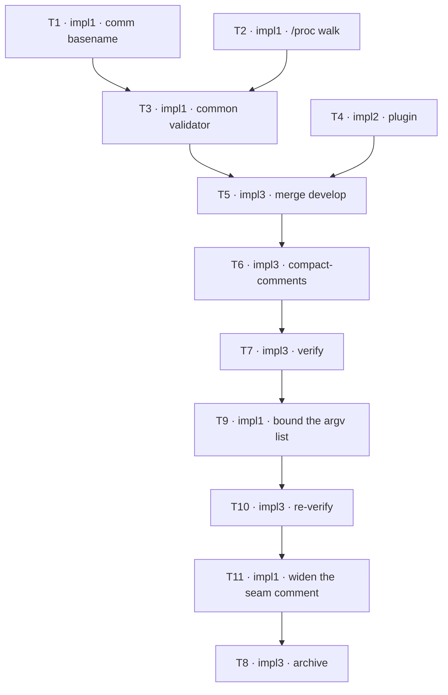

## TODOs: Non-blocking attach scan

Status legend: `[ ]` pending · `[x]` done. Each row flips inside its own commit —
by the row's owner where its role is ungated, by that owner's critic on APPROVE
where the `Critics:` line arms it.
Critics: plan=1 impl=1

### Phase 1 — attach script and hook (impl1)

| ID | Agent | Task | Depends on | Status |
|----|-------|------|------------|--------|
| T1 | impl1 | Normalize `comm` by basename in `find_agent_pid` (`scripts/zellaude-hook.sh:283-285`) so the `claude*\|codex*` match works whether `ps -o comm=` returns a full path or a bare name. `ucomm` is forbidden — it returns the rewritten process title (`2.1.191` measured on macOS). Cover it in `tests/hook_mode_detection.sh` with the argument-branching `ps` stub the PLAN's Verification specifies. Until this lands the validator does nothing on macOS. | — | [x] |
| T2 | impl1 | Replace the pane-record drive loop in `scripts/zellaude-attach.sh` with `list_pane_processes`: one batched `/proc/*/environ` pass, Linux-only behind the existing `uname` gate, selecting each pane's `claude`/`codex` processes directly. Retire `foreground_pid` and the depth-64 parent climb; keep `proc_stat_value`, which `discover_claude` still needs. Rework the fixtures in `tests/attach_detection.sh` to model whole pane process sets. | — | [x] |
| T3 | impl1 | Replace the cached-state cross-check with `cached_agent_is_gone` — common to both platforms, no `uname` branch, dropping only on positive evidence per the PLAN's rules. Add `agent_pid` and `host` to the `emit_cached_states` jq projection. Delete `record_client_for_pane` and argv `$2`; `scan_started_ms` becomes `$2`. Carry the same `comm` basename rule as T1 and the second `ps` stub. The T1 edge buys rule continuity and macOS runtime efficacy, not testability — T3 ships its own stub and is testable without it. | T1, T2 | [x] |

### Phase 2 — plugin (impl2)

| ID | Agent | Task | Depends on | Status |
|----|-------|------|------------|--------|
| T4 | impl2 | Delete the three blocking host calls (`src/attach.rs:63`, `:70`, `src/main.rs:512`) and the four symbols they orphan: `supports_pane_introspection`, `client_for_command`, `introspection_supported()`, `State::pane_introspection_supported`, with their unit tests. `run()` loses its `supports_introspection` parameter; the `pane_leaders` and `introspection_supported` context keys go; argv drops to session name plus `scan_started_ms`. Keep `get_zellij_version` (live caller in `split_three`), the 0.44 floor and the 7-element `REQUIRED_PERMISSIONS`. Update `README.md:588-589` and mark the `better-codex` spec superseded. Leave poll-era introspection prose alone — see the PLAN's out-of-scope note. | — | [x] |

### Finalize (impl3)

| ID | Agent | Task | Depends on | Status |
|----|-------|------|------------|--------|
| T5 | impl3 | Merge from the integration branch: the moment deps clear — no gate — merge `develop` into the feature branch, resolving conflicts with best judgment. Expect friction in `README.md` and `tests/hook_mode_detection.sh`, both edited on either side. An extra merge loop appends fresh rows — this one never re-runs. Protocol: `madev-impl` Finalization. | T3, T4 | [x] |
| T6 | impl3 | Compact-comments pass over the touched files per the session's coding standards: default none, terse WHY only; light touch-ups, no behavior change; remove resolved CLAUDE notes; commit. | T5 | [x] |
| T7 | impl3 | Run the PLAN's Verification on the merged + tidied state, E2E included — both legs, preflight first, artifacts to `/tmp/nonblocking-attach-scan/`. Re-run `tests/hook_mode_detection.sh` after the merge rather than trusting any pre-merge green. On failure or a non-discriminating base arm, report to the planner and wait — never self-fix, never make room. | T6 | [x] |
| T9 | impl1 | Stop the walk putting one argument per process on the command line. Both greps in `list_pane_processes` glob-expand — `"$PROC_ROOT"/*/comm` and `"$PROC_ROOT"/*/environ`. Measured ceiling ~110,376 processes at `ARG_MAX` 2 MB (~19 bytes/arg); past it `execve` fails with `E2BIG` so `grep` never starts, and discovery yields nothing — silently in production, where the plugin discards the stderr bash writes. `-s` is not the mechanism; it suppresses messages about missing or unreadable files. The batched-pass rule still governs: batching through `xargs` is fine — it chunks to its own **131,072-byte command buffer**, not to the system limit, and stays a handful of invocations rather than one per process. Do not conflate the two: `ARG_MAX` is 2,097,152 (`getconf`), while `xargs --show-limits` reports what it *could* use as ~2,088,8xx — that is ARG_MAX less the environment, so it varies between shells and is not a constant. The 131,072 buffer is ~16x under either, and it is why chunking begins around **6,900 processes for the `comm` glob and 6,000 for `environ`** — measured, not derived: `xargs` accounts each argument at path+NUL, so 19 and 22 bytes at a 7-digit pid, the same convention as the ceiling. That is nowhere near the ~110,000 processes where the pre-T9 defect bit. A per-process loop is not acceptable. Coverage: no fixture reaches 110k processes, so a test that merely runs the new code asserts nothing about argv length. What is testable is **behavioural identity** — every existing `tests/attach_detection.sh` case passes with the **fixtures unmodified**. Adjusting a fixture to suit the new form destroys the guard; if a case needs changing, report it rather than change it. If the implementation exposes a chunk size, additionally force more than one chunk at fixture scale so the multi-invocation path executes rather than being assumed. | — | [x] |
| T10 | impl3 | Re-run the PLAN's Verification on the fixed tree: all suites, both E2E legs, the per-term timing assertions. Report Leg A's two counts as numbers. Same rules as T7 — report and wait on failure, never self-fix. | T9 | [x] |
| T11 | impl1 | Widen the `ZELLAUDE_PROC_SCAN_MAX_ARGS` comment at `scripts/zellaude-attach.sh:158`. It reads "Test hook: forces more than one xargs invocation at fixture scale" — true, but a reader concludes "test only, ignore" and misses that a low value in production defeats the batching rule: at 1 the walk becomes one exec per file, the shape the walk exists to avoid. The PLAN carries that warning and the PLAN is deleted at archival, so the comment is the only durable home. **Comment-only change** — no behaviour, no contract. Verification is scoped to match: the critic confirms that **every added and every removed line is a comment** — checking the added side alone would pass a change that deletes a line of code beside a new comment — then `bash -n scripts/zellaude-attach.sh` and `bash tests/attach_detection.sh`. Both are needed: `bash -n` catches a syntax break, and only the suite catches a code line deleted beside an added comment, which is syntactically fine and behaviourally wrong. No E2E re-run; a comment cannot move a timing term. | — | [x] |
| T8 | impl3 | Archive on the planner's explicit go: clear leftover feature CLAUDE notes, append the History entry, delete/prune this feature's in-flight seed, `git rm` the PLAN+TODO pair (`[archive]`), `macoord cleanup`. Protocol: `madev-impl` Finalization. | T11 | (Not possible to mark after deletion) |

**Dependency graph**

**Launch order** — open every session at once; blocked ones idle on `wait-for`.
- `impl1` — entry T1 (—) · `impl1-crit1`
- `impl2` — entry T4 (—) · `impl2-crit1`
- `impl3` — entry T5 (waits on T3, T4) · `impl3-crit1`
- Reopened at closure: `impl1` takes T11 (ready now); archival T8 waits on it.
- Reopened after checkpoint 5: `impl1` takes T9 (ready now), `impl3` takes
  T10 (waits on T9). Archival T8 now waits on T10.
